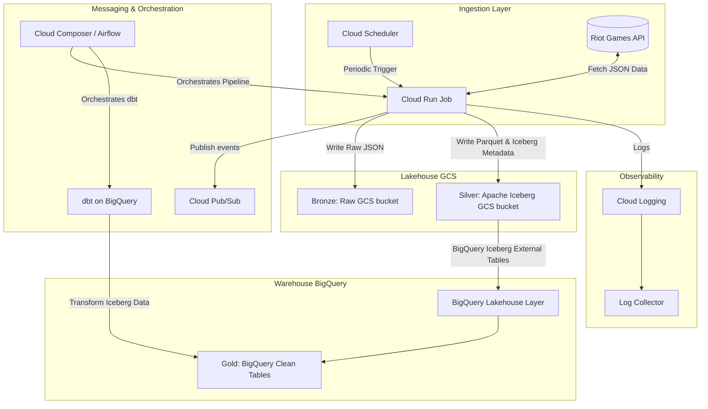

# System Patterns: DataRift

## Architecture Overview

DataRift uses a serverless and managed Medallion Lakehouse architecture on GCP, orchestrated by Cloud Composer and provisioned by Terraform.

## Key Technical Decisions

1. **Medallion Lakehouse Architecture**:
   - **Bronze (Raw)**: Unmodified JSON payloads from Riot API stored in GCS. Helps in re-processing if needed.
   - **Silver (Structured)**: Parquet format with Apache Iceberg metadata stored in GCS. Exposes tables with schema evolution and partition pruning.
   - **Gold (Aggregated / Cleaned)**: Analytical tables stored directly in BigQuery, optimized for BI queries.
2. **Serverless Compute (Cloud Run Jobs)**:
   - Python 3.14 ingestion containers are executed on-demand. Eliminates the cost of idle VMs.
   - Cloud Run Jobs are ideal for batch ingestion runs that exceed Cloud Run Services' timeouts.
3. **Apache Iceberg on GCS**:
   - Implements transactional metadata on GCS object storage. Enables schema evolution, time-travel, and ACID transactions directly on GCS files, minimizing data warehouse storage costs.
4. **dbt for In-Warehouse Transformations**:
   - Transforms Silver Iceberg external tables in BigQuery into analytical Gold models using SQL, tracking lineage, and performing tests.
5. **Infrastructure as Code (Terraform)**:
   - Every resource (GCS buckets, BigQuery datasets, Cloud Run Jobs, Pub/Sub topics, Composer environments, IAM bindings) is defined declaratively using Terraform modules.

## Component Relationships

- **Cloud Composer** is the central orchestrator. It triggers the Cloud Run Job for data ingestion, monitors it, and then triggers the `dbt` run to perform warehouse transformations.
- **Cloud Scheduler** is used for light, time-based triggers that can kick off ingestion directly or publish to **Pub/Sub** topics.
- **Cloud Run Job** fetches data from Riot API, writes raw files to GCS, and converts them to Apache Iceberg format.
- **Log Collector** aggregates logs from Cloud Logging for ingestion runs, API responses, and errors, ensuring that rate limits or data anomalies are flagged immediately.
